# dev-skills-kit

**对主流开源 AI 开发 Skills 的优点提纯——去掉教条，保留精华，补上缺失。**

运行一条命令，就能把从多个开源仓库中精选的 ~33 个 AI Skills 安装进你的项目，并自动适配 Antigravity、Cursor、Codex、OpenCode、Gemini CLI、Claude Code 六个 AI 平台。

---

## 项目定位


> **一句话总结**：Superpowers 的方法论是骨架，缺陷补丁是关节，ECC 的技术 Skills 是肌肉，process.md 是记忆。四者提纯组合，灵活分级，才是适合真实项目的最优解。

---

## 快速开始

**方式一：让 AI 帮你安装（推荐）**

克隆本仓库后，把 `AI_INSTANCE.md` 的路径发给你正在使用的 AI Agent，它会自动识别仓库位置并完成安装——无需手动输入任何命令。

**方式二：手动安装**

```bash
git clone <repo-url> <your-local-path>
cd <your-local-path>
./install.sh /path/to/your/project
```

安装脚本自动完成：精选 ~33 个上游 Skills → 复制本地维护 Skills → 分发六端平台配置 → 复制 process.md 模板 → 初始化 OpenSpec → 更新 `.gitignore`。

**安装完成后**

打开目标项目，向 AI 发送 `/go`，它会自动加载规则、检查是否有进行中的任务，然后进入工作状态。

---

## 核心设计

### Process-Driven Workflow（核心创新）

传统的 `AGENTS.md`（规则）+ `progress.md`（状态）分离模式在长会话中容易导致 AI "失忆"。dev-skills-kit 引入了统一的 **process.md 模板系统**，按复杂度分级，每级对应不同的步骤数：



每个步骤有三种状态：⬜ 未开始 → 🔄 进行中 → ✅ 已完成。中断后执行 `/go` 即可从 `process.md` 恢复。

**阻塞点机制（⏳ Blocking Gate）**：关键决策步骤必须停下等待用户确认，严禁自动跳过——杜绝 AI "自以为是"地推进。

### 按需加载架构


`/go` workflow 内嵌场景分级调度器和核心规则，具体的 Skill 指导以独立 SKILL.md 文件存在。AI 根据任务复杂度**按需 `view_file` 读取**，既节约 Token，又减少长会话中的规则遗忘。

### 多平台构建与分发


`install.sh` 将 Skills、Workflows、Templates 和各平台拦截配置分发到目标项目。特殊策略：
- 六端 workflow 同步分发（.cursor/commands/、.claude/commands/ 等）
- Gemini CLI 用 **JSON 深合并**保护用户已有的 settings.json
- Codex 写入 **全局** `~/.codex/prompts/`（Codex 仅识别全局 Prompts）
- 标记区块补丁（`safe_patch_markers`）确保只修改 dev-skills-kit 管理的内容

### 防遗忘与中断恢复


| 防护机制 | 说明 |
|---------|------|
| **process.md 三态系统** | ⬜→🔄→✅ 严格顺序，不可跳过 |
| **Anti-Context-Decay** | 每 2 次搜索保存 findings.md、重大决策前重读 process.md |
| **3-Strike Protocol** | 同一问题 3 次修复失败 → 暂停请求人工介入 |
| **git tag 安全点** | 关键操作前自动创建标签，支持安全回滚 |
| **会话分割** | Large 任务在自然断点主动分割，防止上下文溢出 |

---

## Skills 全景图


### 来自上游的 Skills

| 来源 | Skills | 数量 |
|------|--------|------|
| **Superpowers** | brainstorming, writing-plans, executing-plans, test-driven-development, systematic-debugging, verification-before-completion, requesting-code-review, receiving-code-review, dispatching-parallel-agents, using-git-worktrees, finishing-a-development-branch, writing-skills, using-superpowers | 13 |
| **ECC** | continuous-learning-v2, python-patterns, python-testing, golang-patterns, golang-testing, frontend-patterns, coding-standards, springboot-patterns, java-coding-standards, api-design, database-migrations, docker-patterns, deployment-patterns, e2e-testing, backend-patterns | 15 |

### 本地维护的 Skills

| Skill | 用途 | 来源 |
|-------|------|------|
| auto-learning | 零 Hooks 经验沉淀（所有平台通用） | 原创 |
| planning-with-files | 3 文件状态持久化 | 改编自 [planning-with-files](https://github.com/OthmanAdi/planning-with-files) |
| security-guidance | 安全编码指导 | 改编自 Anthropic 安全插件 |
| dev-skills-kit-check | 项目级变更自检清单 | 原创 |
| test-driven-development | RED-GREEN-REFACTOR 循环，灵活 TDD | 改编自 superpowers |
| systematic-debugging | 4 阶段根因分析 | 改编自 superpowers |
| verification-before-completion | 完成前强制验证 | 改编自 superpowers |

---

## 工作流命令

| 命令 | 用途 |
|------|------|
| `/go` | 重新加载规则，从 `process.md` 恢复中断的任务 |
| `/learn` | 提取当前会话的可复用经验，保存到知识库 |
| `/reset` | 清理 `process.md` 等状态文件，重置为干净状态 |
| `/concurrency` | 评估 OpenSpec 变更，用 git worktree 创建独立并发开发环境 |
| `/save-to-kb` | 显式保存知识到知识库（验证保存） |

---

## 安装后项目结构


> 目标项目**完全自给自足**：所有路径为相对路径，可随意迁移，无外部依赖。

---

## 平台适配速查


| 平台 | 拦截入口 | 特殊处理 |
|------|---------|---------|
| **Antigravity** | `.agent/workflows/` | 原生支持 |
| **Cursor** | `.cursor/commands/` | 自动同步 workflow |
| **Codex** | `~/.codex/prompts/` | 全局安装 |
| **OpenCode** | `.opencode/commands/` | 自动同步 workflow |
| **Gemini CLI** | `.gemini/commands/` | JSON 深合并 settings.json |
| **Claude Code** | `.claude/commands/` | 自动同步 workflow |

---

## 缺陷补丁（Superpowers 修正）

dev-skills-kit 对 Superpowers 的已知缺陷提供了 4 个内置补丁：

| 补丁 | 解决的问题 |
|------|-----------|
| **复杂度分级** | 避免小任务被完整流程拖慢（改变量名不需要 11 步） |
| **TDD 灵活化** | UI/配置/ML 等场景允许替代验证，不强求先写测试 |
| **Expert Mode** | 用户已给出详细方案时跳过苏格拉底式追问 |
| **遗留代码适配** | 不要求全局绿色基线，支持局部基线和渐进式引入测试 |

---

## 使用心得

> [!WARNING]
> **不要使用 AI 工具的 Plan 模式。** 许多 AI 编程工具（如 Cursor、Claude Code 等）提供了内置的 Plan 模式，启用后工具会强制使用自己的 workflow，覆盖掉 dev-skills-kit 的 process.md 流程。请始终使用**普通模式（Normal / Ask 模式）**，让 `/go` 中定义的场景分级和 process.md 来驱动工作流。

> [!TIP]
> **上下文变长时，主动发送 `/go` 刷新 AI 记忆。** 长会话中 AI 会逐渐遗忘规则（Context Decay）。当你感觉 AI 开始跳过步骤、不再遵守流程、或回答质量下降时，直接发送 `/go`——它会重新加载完整规则、读取 `process.md` 当前状态，从断点继续。这比开新会话更高效，因为无需重复描述需求。

---

## 更新上游 Skills

```bash
cd <your-local-path>             # dev-skills-kit 所在目录
./update-sources.sh              # 拉取最新源码到 github-source/
./install.sh /path/to/project    # 重新安装到目标项目（-f 强制覆盖）
```

---

## 上游仓库

| 仓库 | 引用方式 |
|------|----------|
| [superpowers](https://github.com/obra/superpowers) | SKILL.md 方法论 |
| [everything-claude-code](https://github.com/affaan-m/everything-claude-code) | SKILL.md 技术栈规范 |
| [claude-code/plugins](https://github.com/anthropics/claude-code/tree/main/plugins) | Anthropic 官方 Skills |
| [planning-with-files](https://github.com/OthmanAdi/planning-with-files) | SKILL.md 状态持久化 |
| [OpenSpec](https://github.com/Fission-AI/OpenSpec) | CLI 工具，大型任务规范归档 |
