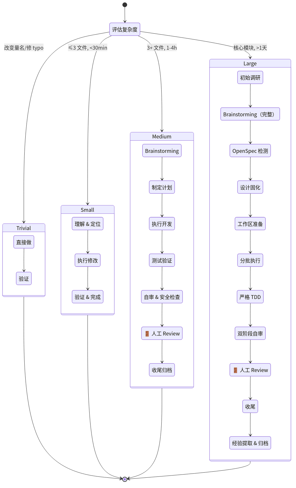
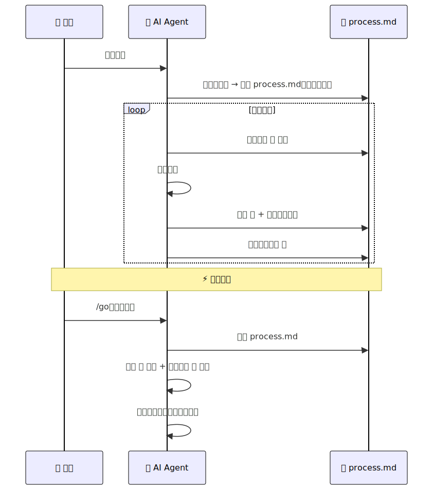

# dev-skills-kit

**对主流开源 AI 开发 Skills 的优点提纯——去掉教条，保留精华，补上缺失。**

运行一条命令，就能把从多个开源仓库中精选的 ~33 个 AI Skills 安装进你的项目，并自动适配 Antigravity、Cursor、Codex、OpenCode、Gemini CLI、Claude Code 六个 AI 平台。

---

## 项目定位



> **一句话总结**：Superpowers 的方法论是骨架，缺陷补丁是关节，ECC 的技术 Skills 是肌肉，process.md 是记忆。四者提纯组合，灵活分级，才是适合真实项目的最优解。

---

## 快速开始

**方式一：让 AI 帮你安装（推荐）**

克隆本仓库后，把 `AI_INSTANCE.md` 的路径发给你正在使用的 AI Agent，它会自动识别仓库位置并完成安装——无需手动输入任何命令。

**方式二：手动安装**

```bash
git clone <repo-url> <your-local-path>
cd <your-local-path>
./install.sh /path/to/your/project
```

安装脚本自动完成：精选 ~27 个上游 Skills → 构建六端配置 → 分发平台拦截规则 → 复制 process.md 模板 → 初始化 OpenSpec → 更新 `.gitignore`。

**安装完成后**

打开目标项目，向 AI 发送 `/go`，它会自动加载规则、检查是否有进行中的任务，然后进入工作状态。

---

## 核心设计

### Process-Driven Workflow（核心创新）

传统的 `AGENTS.md`（规则）+ `progress.md`（状态）分离模式在长会话中容易导致 AI "失忆"。dev-skills-kit 引入了统一的 **process.md 模板系统**，按复杂度分级，每级对应不同的步骤数：



每个步骤有三种状态：⬜ 未开始 → 🔄 进行中 → ✅ 已完成。中断后执行 `/go` 即可从 `process.md` 恢复。

### 按需加载架构



AGENTS.md 只定义调度逻辑和分级规则，具体的 Skill 指导以独立文件存在。AI 根据任务复杂度**按需读取**，既节约 Token，又减少长会话中的规则遗忘。

### 多平台构建与分发



`build.sh` 将共享组件和平台特有组件拼装为各平台专属的 AGENTS 配置文件，`install.sh` 负责分发到目标项目。

### 防遗忘与中断恢复



---

## Skills 全景图


### 本地维护的 Skills

| Skill | 用途 | 来源 |
|-------|------|------|
| auto-learning | 零 Hooks 经验沉淀（替代 continuous-learning-v2） | 原创 |
| planning-with-files | 3 文件状态持久化 | 改编自 [planning-with-files](https://github.com/OthmanAdi/planning-with-files) |
| security-guidance | 安全编码指导 | 改编自 Anthropic 安全插件 |
| test-driven-development | RED-GREEN-REFACTOR 循环，灵活 TDD | 改编自 superpowers |
| systematic-debugging | 4 阶段根因分析 | 改编自 superpowers |
| verification-before-completion | 完成前强制验证 | 改编自 superpowers |

---

## 工作流命令

| 命令 | 用途 |
|------|------|
| `/go` | 重新加载规则，从 `process.md` 恢复中断的任务 |
| `/learn` | 提取当前会话的可复用经验，保存到知识库 |
| `/reset` | 清理 `process.md` 等状态文件，重置为干净状态 |

---

## 安装后项目结构



> 目标项目**完全自给自足**：所有路径为相对路径，可随意迁移，无外部依赖。

---

## 平台适配速查


---

## 更新上游 Skills

```bash
cd <your-local-path>             # dev-skills-kit 所在目录
./update-sources.sh              # 拉取最新源码到 github-source/
./install.sh /path/to/project    # 重新安装到目标项目（-f 强制覆盖）
```

---

## 上游仓库

| 仓库 | 引用方式 |
|------|----------|
| [superpowers](https://github.com/obra/superpowers) | SKILL.md 方法论 |
| [everything-claude-code](https://github.com/affaan-m/everything-claude-code) | SKILL.md 技术栈规范 |
| [claude-code/plugins](https://github.com/anthropics/claude-code/tree/main/plugins) | Anthropic 官方 Skills |
| [planning-with-files](https://github.com/OthmanAdi/planning-with-files) | SKILL.md 状态持久化 |
| [OpenSpec](https://github.com/Fission-AI/OpenSpec) | CLI 工具，大型任务规范归档 |
