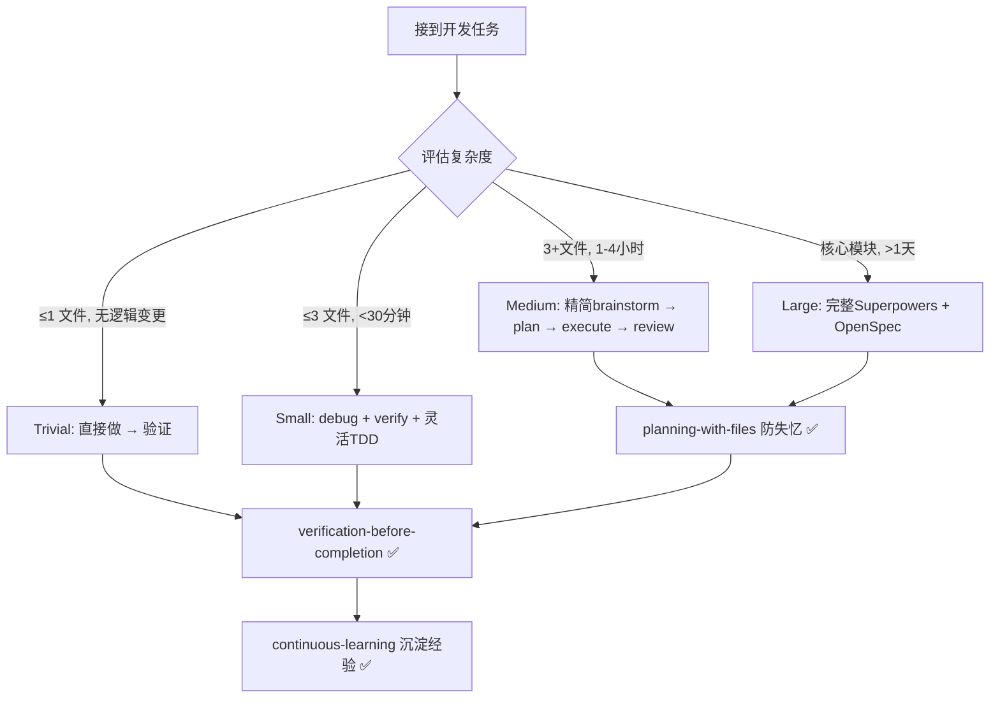

# 企业开发者 AI Skills 最优组合指南

> 基于 [skills-analysis.md](docs/skills-analysis.md)（推荐方案）和 [superpowers-skills-analysis.md](docs/superpowers-skills-analysis.md)（缺陷分析）的综合决策指南。
>
> 核心问题：**如何避开 Superpowers 的过度理想化陷阱，同时保留其方法论优势，组合出一套适合企业日常开发的 Skills？**

---

## 一、矛盾分析：推荐 vs 缺陷

`skills-analysis.md` 推荐 Superpowers 为五星必选，但 `superpowers-skills-analysis.md` 揭示了 **11 个真实问题**。下面将这些矛盾整理为决策依据：

| 推荐理由 | 对应缺陷 | 影响程度 | 应对策略 |
|----------|----------|----------|----------|
| 唯一覆盖全流程 | 🔴 小任务流程过载（改个变量名也要 6 步） | **高** | 引入复杂度分级，小任务绕过 |
| TDD 铁律保障质量 | 🟠 TDD 教条化（UI/ML/配置不适合严格 TDD） | **中** | 扩展例外场景，提供替代验证策略 |
| 子代理驱动开发 | 🔴 Token 爆炸（10 任务 ≥ 30 次子代理调用） | **高** | 区分轻量/标准/完整模式 |
| 子代理驱动开发 | 🔴 平台强绑定（深度依赖 Claude Code） | **高** | 准备降级方案 |
| 反合理化防御 | 🟡 过度反合理化可能导致无意义遵从 | **低** | 增加正当例外机制 |
| 设计 → 计划 → 执行 | 🟡 用户体验疲劳（经验丰富者被过度追问） | **低** | 支持 expert mode |
| — | 🟠 假设干净代码库（遗留代码卡在第一步） | **中** | 支持局部基线验证 |
| — | 🟡 没有学习/反馈机制 | **低** | 用 ECC 的 continuous-learning 补充 |
| — | 🟡 技能覆盖盲区（缺部署/安全/文档） | **低** | 从 ECC 按需补充 |

> [!IMPORTANT]
> **关键结论**：Superpowers 的**方法论**值得采用（TDD、设计先行、代码审查），但**不能原样照搬其全部流程**。企业开发者需要的是 **方法论 + 灵活性**，而不是 **方法论 + 教条**。

---

## 二、企业开发者的三种典型场景

在给出最终方案前，先明确你日常开发中的三种场景——**不同场景用不同强度的流程**：

```
场景 A: 快速修复 / 小改动（占日常 60%）
  例：修 bug、改配置、调样式、重命名、添加字段
  耗时：5-30 分钟
  需要：快速、精准、不打断心流

场景 B: 中型功能开发（占日常 30%）
  例：新增 API 端点、实现业务逻辑模块、增加报表页面
  耗时：1-4 小时
  需要：合理规划、有测试、有审查

场景 C: 大型功能 / 重构（占日常 10%）
  例：重写认证系统、数据库迁移、微服务拆分
  耗时：1-5 天
  需要：完整规范、多阶段审查、可追溯
```

> [!TIP]
> **Superpowers 的完整流程只适合场景 C**。如果你把每个场景都当 C 来跑，60% 的日常工作会被严重拖慢。

---

## 三、最终推荐方案：场景分级 Skills 组合

### 核心原则

```
不是"装哪些 Skills"，而是"在什么场景下激活哪些 Skills"
```

### 分场景 Skills 矩阵

| Skill / 能力 | 来源 | 场景 A（快速修复） | 场景 B（中型功能） | 场景 C（大型功能） |
|--------------|------|:--:|:--:|:--:|
| **systematic-debugging** | Superpowers | ✅ | ✅ | ✅ |
| **verification-before-completion** | Superpowers | ✅ | ✅ | ✅ |
| **test-driven-development** | Superpowers | ⚠️ 灵活 | ✅ | ✅ |
| **brainstorming** | Superpowers | ❌ 跳过 | ⚠️ 精简版 | ✅ |
| **writing-plans** | Superpowers | ❌ 跳过 | ✅ | ✅ |
| **subagent-driven-development** | Superpowers | ❌ 跳过 | ❌ 跳过 | ✅ |
| **executing-plans** | Superpowers | ❌ 跳过 | ✅ 替代子代理 | ⚠️ 备选 |
| **using-git-worktrees** | Superpowers | ❌ 跳过 | ⚠️ 可选 | ✅ |
| **requesting/receiving-code-review** | Superpowers | ❌ 跳过 | ✅ | ✅ |
| **finishing-a-development-branch** | Superpowers | ❌ 跳过 | ✅ | ✅ |
| **planning-with-files (3 文件)** | OthmanAdi | ❌ 跳过 | ✅ | ✅ |
| **OpenSpec (规范驱动)** | Fission-AI | ❌ 跳过 | ❌ 跳过 | ✅ |
| **语言/框架 patterns** | ECC 按需选取 | ✅ 参考 | ✅ 参考 | ✅ 参考 |
| **continuous-learning-v2** | ECC | ✅ | ✅ | ✅ |
| **security-review** | ECC | ❌ | ⚠️ 涉及安全时 | ✅ |
| **docker-patterns / deployment** | ECC | ❌ | ⚠️ 涉及部署时 | ✅ |

> ✅ = 必须激活 | ⚠️ = 按需/灵活 | ❌ = 跳过

### 各场景详解

#### 场景 A：快速修复（"外科手术模式"）

```
触发条件：改动 < 3 个文件 且 预计 < 30 分钟

激活 Skills：
  ├─ systematic-debugging     → 遇到 bug 时系统化分析
  ├─ verification-before-completion → 改完必须验证
  ├─ TDD（灵活版）           → 有现成测试就更新，没有不强求补
  └─ 语言 patterns（参考）    → 遵循编码规范

跳过：brainstorming, writing-plans, worktrees, 子代理, 代码审查
```

**为什么这样选？**
- `superpowers-skills-analysis.md` 指出的 **流程过载问题** 在这里最致命——改变量名不需要 6 步流程
- 但 `systematic-debugging` 和 `verification-before-completion` 是**零开销高回报**的 skills，任何改动都应遵守

#### 场景 B：中型功能开发（"标准模式"）

```
触发条件：涉及 3+ 文件 或 预计 1-4 小时

激活 Skills：
  ├─ brainstorming（精简版）  → 快速确认方案，不逐个追问
  ├─ writing-plans            → 拆成小任务
  ├─ executing-plans          → 分批执行（不用子代理驱动，省 token）
  ├─ TDD                     → 标准 RED-GREEN-REFACTOR
  ├─ planning-with-files      → 3 文件防失忆
  ├─ code-review              → 完成后审查
  ├─ finishing-branch          → 标准分支收尾
  ├─ systematic-debugging     → 随时待命
  ├─ verification-before-completion → 强制验证
  └─ 语言 patterns + continuous-learning

跳过：subagent-driven-development, OpenSpec, worktrees（可选开启）
```

**为什么这样选？**
- **用 `executing-plans` 替代 `subagent-driven-development`**：省去每任务 3 个子代理的成本。`superpowers-skills-analysis.md` 指出 10 任务 = 30+ 子代理调用，这对中型功能是杀鸡用牛刀
- **brainstorming 精简版**：检测用户需求详细度——如果用户已给出完整需求，减少提问，直接到 writing-plans
- **planning-with-files 在这里最有价值**：中型功能常跨越多个会话，3 文件防失忆正好解决这个痛点

#### 场景 C：大型功能 / 重构（"完整模式"）

```
触发条件：涉及核心模块 或 预计 > 1 天 或 需要需求可追溯

激活 Skills：全部
  ├─ OpenSpec                 → proposal → specs → design → tasks 完整链
  ├─ brainstorming           → 完整苏格拉底式设计
  ├─ using-git-worktrees     → 隔离工作区
  ├─ writing-plans            → 详细实施计划
  ├─ subagent-driven-dev     → 子代理 + 双阶段审查（此时值得投入 token）
  ├─ TDD                     → 严格执行
  ├─ planning-with-files      → 跨天防失忆
  ├─ code-review              → 多轮审查
  ├─ finishing-branch         → 标准收尾
  ├─ security-review          → 安全审查
  ├─ docker/deployment        → 如涉及部署
  └─ continuous-learning      → 沉淀经验

增强措施（针对 superpowers-skills-analysis.md 提出的问题）：
  ├─ 审查循环上限 = 3 次     → 超过则暂停请求人工介入
  ├─ 关键操作前 git tag      → 灾难恢复点
  └─ 控制器上下文监控        → 接近上限时保存状态
```

**为什么这样选？**
- 大型功能是 Superpowers 的**最佳适用场景**——完整流程的成本被大任务的复杂度所消化
- OpenSpec 在这里**真正有价值**：需求可追溯、有 proposal/specs/design 归档
- 但必须加上 `superpowers-skills-analysis.md` 建议的**安全措施**：审查上限、git tag 回滚点、上下文监控

---

## 四、缺陷补丁：用规则弥补 Superpowers 的不足

`superpowers-skills-analysis.md` 揭示的问题不能靠"少装几个 skill"解决，需要**在项目配置中增加补充规则**。以下是具体的补丁：

### 补丁 1：复杂度自动分级（解决流程过载）

在你的 `AGENTS.md` 或 `CLAUDE.md` 中加入：

```markdown
## 复杂度分级规则

在接到任何任务后，先评估复杂度等级：

| 等级 | 条件 | 流程 |
|------|------|------|
| **trivial** | 改动 ≤ 1 个文件，无逻辑变更 | 直接做 → 验证 → 完成 |
| **small** | 改动 ≤ 3 个文件，< 30 分钟 | debugging + verification + 灵活 TDD |
| **medium** | 3+ 文件 或 1-4 小时 | 精简 brainstorming → plans → executing → review |
| **large** | 核心模块 或 > 1 天 | 完整 Superpowers 流程 + OpenSpec |

> [!IMPORTANT]
> 不要把 trivial/small 任务升级为 medium/large。流程过度本身就是一种浪费。
```

### 补丁 2：TDD 灵活化（解决教条主义）

```markdown
## TDD 例外场景

以下场景允许跳过"先写测试"，但必须有替代验证：

| 场景 | 替代验证方式 |
|------|------------|
| UI / 前端样式 | 截图对比 或 手动验证 + 记录 |
| 配置文件修改 | 运行应用验证配置生效 |
| 一次性脚本 / 原型 | smoke test + 输出验证 |
| ML 训练脚本 | 指标对比（loss/accuracy 变化） |
| 数据库迁移 | 迁移前后数据一致性校验 |
| 基础设施代码 (IaC) | dry-run + plan 输出审查 |

跳过 TDD 时必须在 findings.md 中记录原因。
```

### 补丁 3：Expert Mode（解决用户疲劳）

```markdown
## Expert Mode 快捷通道

当用户在请求中已给出以下信息中的 3 项以上时，自动进入 Expert Mode：
- 技术栈选择
- 具体实现方案
- 接口设计
- 数据结构

Expert Mode 行为：
- ❌ 跳过苏格拉底式逐一提问
- ✅ 直接确认理解 → 补充遗漏点（如有） → 进入 writing-plans
- ✅ 将确认浓缩为一次性呈现，而非分段审批
```

### 补丁 4：遗留代码库适配（解决干净基线假设）

```markdown
## 遗留代码库策略

当项目现有测试不通过或无测试时：

1. **不要求全局绿色基线**，改为局部基线：
   - 只运行与当前变更相关的测试子集
   - 记录已知失败的测试到 findings.md
2. **渐进式引入测试**：
   - 新代码必须有测试
   - 修改的旧代码 → 先写 characterization test 锁定当前行为
   - 不要求一次性补全所有测试
3. **Worktree 创建时**：
   - 基线验证改为：运行相关子集测试 或 确认构建成功即可
```

---

## 五、你的技术栈 → 精确安装清单

根据你的项目技术栈，从 ECC（everything-claude-code）中挑选对应的 Skills。**只装需要的，不全装**。

### 第 1 层：必装（所有企业开发者）

| 安装项 | 来源 | 作用 |
|--------|------|------|
| Superpowers **全部 14 个 skills** | obra/superpowers | 方法论框架 |
| planning-with-files | OthmanAdi | 状态持久化 |
| continuous-learning-v2 | ECC | 经验沉淀 |
| **4 个缺陷补丁规则** | 本文第四部分 | 写入 AGENTS.md |

### 第 2 层：按技术栈选装

| 你的技术栈 | 从 ECC 安装 |
|------------|------------|
| Python (FastAPI/Django) | `python-patterns/` + `python-testing/` |
| Go | `golang-patterns/` + `golang-testing/` |
| TypeScript / React | `frontend-patterns/` + `coding-standards/` |
| Java / Spring Boot | `springboot-patterns/` + `java-coding-standards/` |
| 有 REST API | `api-design/` |
| 有数据库迁移 | `database-migrations/` |
| 有 Docker 部署 | `docker-patterns/` + `deployment-patterns/` |

### 第 3 层：企业级场景选装

| 需求 | 安装 |
|------|------|
| 需求规范 / 审计可追溯 | OpenSpec (Fission-AI) |
| 安全合规要求 | `security-review/` + `security-scan/` (ECC) |
| E2E 测试 | `e2e-testing/` (ECC) |

### ❌ 确认淘汰

| 不装 | 原因 |
|------|------|
| **compound-engineering-plugin** | 被 Superpowers + continuous-learning 完全替代 |
| **openskills** | 工具层，非 Skill 本身，当前工具链不需要 |
| ECC 的 TDD / plan / code-review agents | 与 Superpowers 冲突 |

---

## 六、决策总结



### 一句话总结

> **Superpowers 的方法论是骨架，缺陷补丁是关节，ECC 的技术 Skills 是肌肉，planning-with-files 是记忆。四者组合，灵活分级，才是适合企业开发者的最优解。**

| 维度 | 你的方案 |
|------|----------|
| **方法论** | Superpowers（骨架） |
| **灵活性** | 4 个缺陷补丁（关节） |
| **技术深度** | ECC 按需选取（肌肉） |
| **状态持久化** | planning-with-files（记忆） |
| **规范化** | OpenSpec（仅大型任务） |
| **已淘汰** | compound-engineering, openskills |

